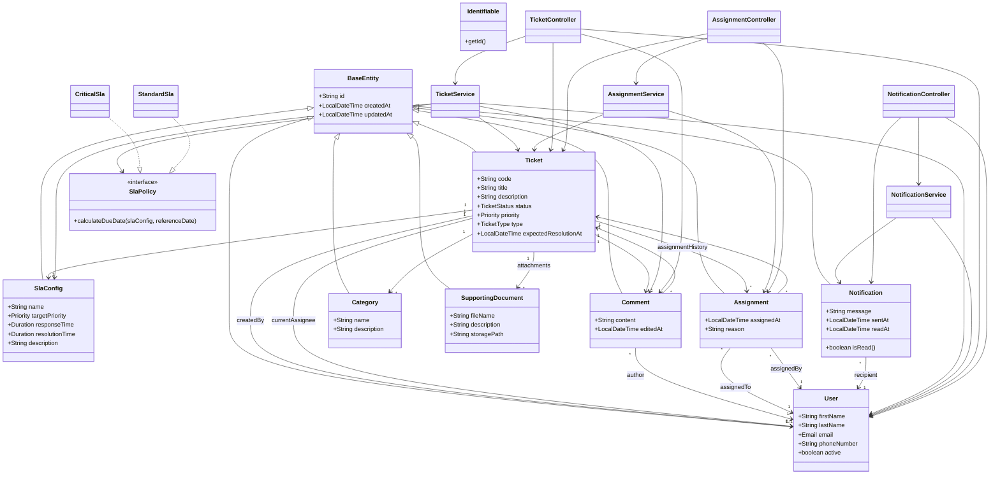

# Class Diagram

```mermaid
classDiagram
    class BaseEntity {
        +String id
        +LocalDateTime createdAt
        +LocalDateTime updatedAt
    }

    class Identifiable {
        +getId()
    }

    class SlaConfig {
        +String name
        +Priority targetPriority
        +Duration responseTime
        +Duration resolutionTime
        +String description
    }

    class Ticket {
        +String code
        +String title
        +String description
        +TicketStatus status
        +Priority priority
        +TicketType type
        +LocalDateTime expectedResolutionAt
    }

    class Comment {
        +String content
        +LocalDateTime editedAt
    }

    class Assignment {
        +LocalDateTime assignedAt
        +String reason
    }

    class Notification {
        +String message
        +LocalDateTime sentAt
        +LocalDateTime readAt
        +boolean isRead()
    }

    class User {
        +String firstName
        +String lastName
        +Email email
        +String phoneNumber
        +boolean active
    }

    class Category {
        +String name
        +String description
    }

    class SupportingDocument {
        +String fileName
        +String description
        +String storagePath
    }

    BaseEntity <|-- SlaConfig
    BaseEntity <|-- Ticket
    BaseEntity <|-- Comment
    BaseEntity <|-- Assignment
    BaseEntity <|-- Notification
    BaseEntity <|-- User
    BaseEntity <|-- Category
    BaseEntity <|-- SupportingDocument

    Ticket "1" --> "1" SlaConfig
    Ticket "1" --> "1" Category
    Ticket "1" --> "1" User : createdBy
    Ticket "1" --> "0..1" User : currentAssignee
    Ticket "1" --> "*" Comment
    Ticket "1" --> "*" Assignment : assignmentHistory
    Ticket "1" --> "*" SupportingDocument : attachments

    Comment "*" --> "1" Ticket
    Comment "*" --> "1" User : author

    Assignment "*" --> "1" Ticket
    Assignment "*" --> "1" User : assignedTo
    Assignment "*" --> "1" User : assignedBy

    Notification "*" --> "1" User : recipient

    class TicketService
    class AssignmentService
    class NotificationService
    class SlaPolicy {
        <<interface>>
        +calculateDueDate(slaConfig, referenceDate)
    }
    class CriticalSla
    class StandardSla
    class TicketController
    class AssignmentController
    class NotificationController

    TicketService --> Ticket
    TicketService --> Comment
    TicketService --> User
    TicketService --> SlaConfig
    TicketService --> SlaPolicy

    AssignmentService --> Assignment
    AssignmentService --> Ticket

    NotificationService --> Notification
    NotificationService --> User

    CriticalSla ..|> SlaPolicy
    StandardSla ..|> SlaPolicy

    TicketController --> TicketService
    TicketController --> Ticket
    TicketController --> Comment
    TicketController --> User

    AssignmentController --> AssignmentService
    AssignmentController --> Assignment
    AssignmentController --> Ticket

    NotificationController --> NotificationService
    NotificationController --> Notification
    NotificationController --> User
```
